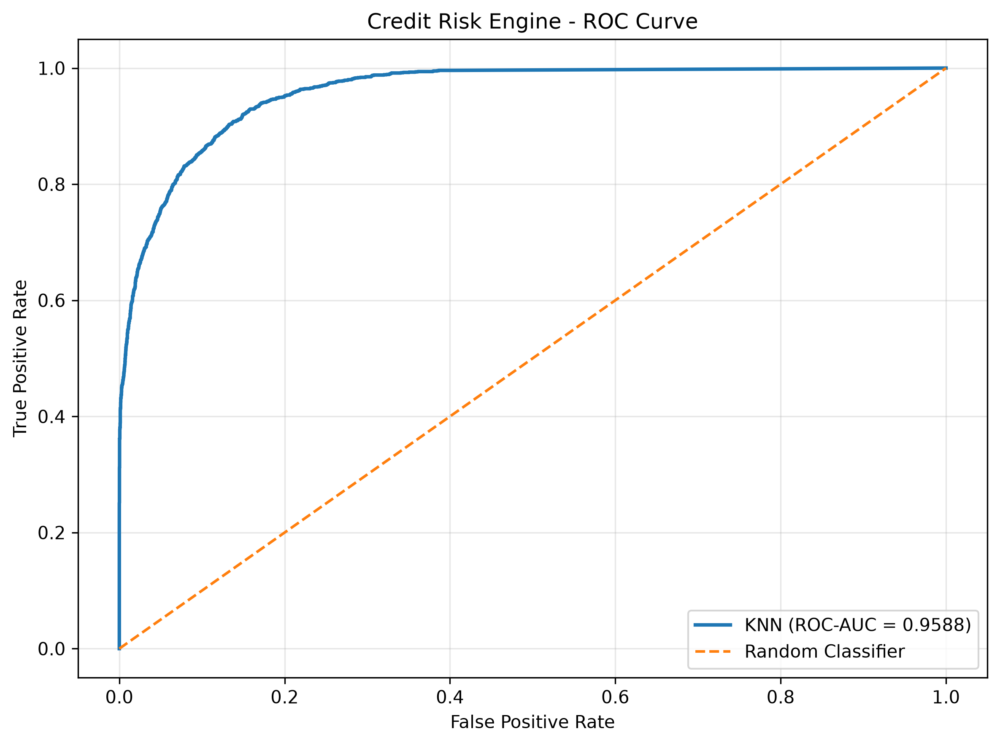
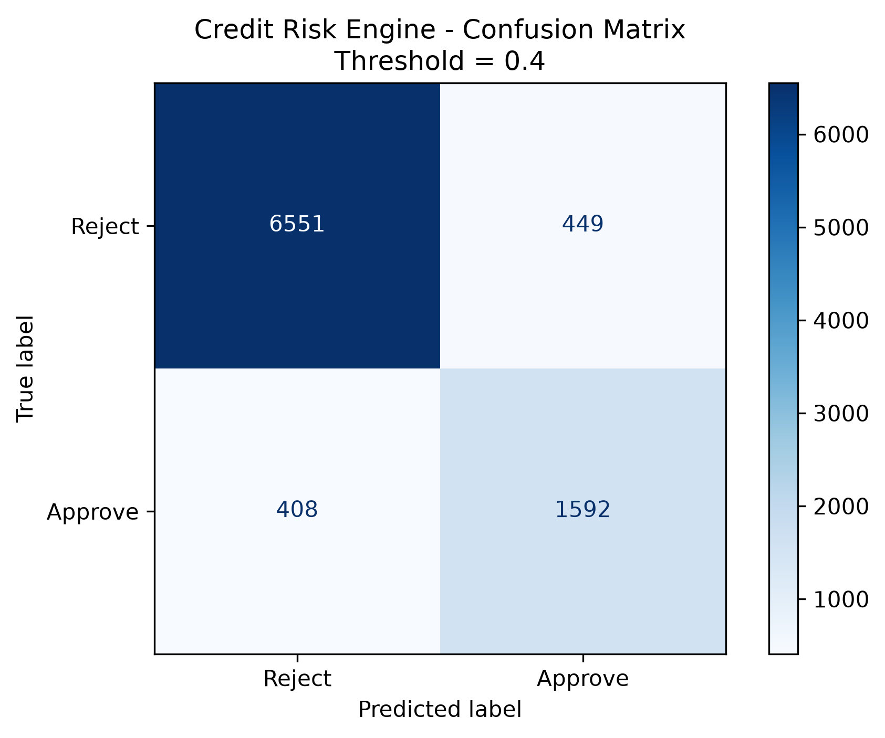
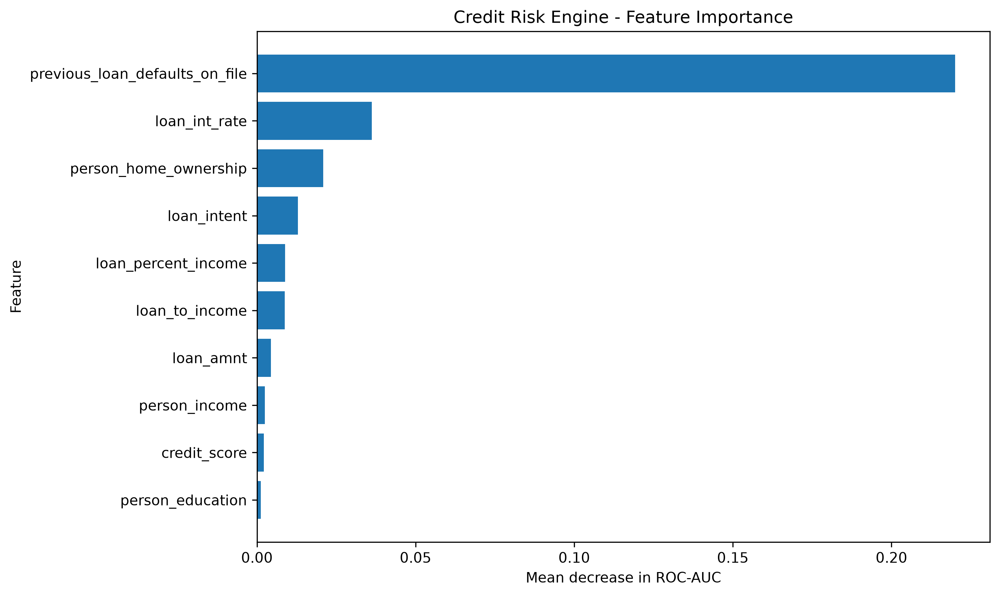

# Credit Risk Engine

A machine learning system that predicts whether a loan application is likely to be **approved or rejected** based on an applicant's financial profile, credit history, employment information, and loan characteristics.

The project includes a complete machine learning pipeline, model evaluation, probability-based decision thresholding, feature importance analysis, and an interactive Streamlit dashboard.

---

## Project Overview

The Credit Risk Engine takes applicant information such as:

- Age
- Gender
- Education
- Annual income
- Employment experience
- Home ownership
- Loan amount
- Loan intent
- Interest rate
- Loan-to-income ratio
- Credit history length
- Credit score
- Previous loan defaults

and predicts:

- **Approval probability**
- **Approve / Reject decision**
- **Risk category**

The system uses a tuned **K-Nearest Neighbors (KNN)** classifier.

---

## Features

### Machine Learning

- Data preprocessing with `scikit-learn`
- Numerical feature imputation
- Feature scaling using `StandardScaler`
- Categorical encoding using `OneHotEncoder`
- Feature engineering with `loan_to_income`
- Stratified train/test split
- KNN model tuning
- ROC-AUC evaluation
- Precision, recall and F1-score evaluation
- Custom production decision threshold

### Explainability

- Permutation feature importance
- Global feature importance visualization
- Applicant-level risk signals
- Model performance visualizations
- Confusion matrix
- ROC curve

### Web Application

- Interactive Streamlit dashboard
- Applicant information form
- Approval probability
- Approve/Reject decision
- Risk classification
- Applicant explanation
- Model performance dashboard
- Feature importance visualization

---

## Project Architecture

```text
credit-risk-engine/
│
├── app/
│   └── app.py
│
├── data/
│   └── loan_data.csv
│
├── models/
│   ├── final_knn_pipeline.joblib
│   └── decision_threshold.joblib
│
├── reports/
│   ├── confusion_matrix.png
│   ├── roc_curve.png
│   ├── feature_importance.png
│   ├── evaluation_metrics.csv
│   ├── confusion_matrix_values.csv
│   ├── classification_report.txt
│   └── feature_importance.csv
│
├── src/
│   ├── predict.py
│   ├── evaluate_model.py
│   └── feature_importance.py
│
├── pyproject.toml
├── uv.lock
└── README.md
```

---

# Machine Learning Pipeline

The project follows this general pipeline:

```text
Raw Applicant Data
        │
        ▼
Data Cleaning
        │
        ▼
Feature Engineering
        │
        ├── loan_to_income
        │
        ▼
Train / Test Split
        │
        ▼
Preprocessing
        │
        ├── Numerical → Median Imputation → StandardScaler
        │
        └── Categorical → Most Frequent Imputation → OneHotEncoder
        │
        ▼
KNN Classifier
        │
        ▼
Probability Prediction
        │
        ▼
Decision Threshold
        │
        ▼
Approve / Reject
```

---

# Dataset

The dataset contains loan application and applicant information.

### Target

```text
loan_status
```

Target encoding:

```text
0 = Reject
1 = Approve
```

### Main Features

| Feature                          | Description                    |
| -------------------------------- | ------------------------------ |
| `person_age`                     | Applicant age                  |
| `person_gender`                  | Applicant gender               |
| `person_education`               | Education level                |
| `person_income`                  | Annual income                  |
| `person_emp_exp`                 | Employment experience          |
| `person_home_ownership`          | Home ownership status          |
| `loan_amnt`                      | Requested loan amount          |
| `loan_intent`                    | Reason for the loan            |
| `loan_int_rate`                  | Loan interest rate             |
| `loan_percent_income`            | Loan amount relative to income |
| `cb_person_cred_hist_length`     | Credit history length          |
| `credit_score`                   | Applicant credit score         |
| `previous_loan_defaults_on_file` | Previous loan default history  |

---

# Feature Engineering

An additional feature is created:

```python
loan_to_income = loan_amnt / person_income
```

This represents the requested loan relative to the applicant's annual income.

It provides the model with another measure of the applicant's potential repayment burden.

---

# Data Preprocessing

### Numerical Features

Numerical missing values are handled using median imputation.

```text
Missing numerical value
        ↓
Median imputation
        ↓
StandardScaler
```

### Categorical Features

Categorical missing values are handled using the most frequent category.

Categories are then converted using:

```python
OneHotEncoder(handle_unknown="ignore")
```

This allows the model to handle previously unseen categories without failing during prediction.

---

# Model

Several classification approaches were explored during development, including:

- Logistic Regression
- K-Nearest Neighbors
- Gaussian Naive Bayes

The tuned **K-Nearest Neighbors** model was selected as the final model.

### Final model configuration

```text
Model:
K-Nearest Neighbors

n_neighbors:
21

weights:
distance

metric:
manhattan
```

The final model is stored as:

```text
models/final_knn_pipeline.joblib
```

---

# Decision Threshold

The application does not simply use the default probability threshold of `0.50`.

A production threshold of:

```text
0.40
```

was selected during model evaluation.

The production decision is:

```python
prediction = approval_probability >= 0.40
```

Therefore:

```text
Probability >= 0.40
        ↓
     APPROVE

Probability < 0.40
        ↓
     REJECT
```

The threshold can be found in:

```text
models/decision_threshold.joblib
```

---

# Model Evaluation

The model is evaluated using:

- Accuracy
- Precision
- Recall
- F1-score
- ROC-AUC
- Confusion matrix
- ROC curve

The evaluation script can be run with:

```bash
python src/evaluate_model.py
```

The generated evaluation files are stored inside:

```text
reports/
```

---

## ROC Curve

The ROC curve evaluates the model's ability to distinguish between approved and rejected applications across different probability thresholds.



---

## Confusion Matrix

The confusion matrix shows how many applications were correctly and incorrectly classified.



---

# Feature Importance

Permutation importance is used to estimate which input features have the greatest influence on model performance.

The analysis is generated with:

```bash
python src/feature_importance.py
```

Output files:

```text
reports/feature_importance.png
reports/feature_importance.csv
```



### Why permutation importance?

KNN does not provide coefficients like Logistic Regression.

Instead, permutation importance measures how much model performance decreases when a feature is randomly shuffled.

A larger decrease indicates that the model relies more heavily on that feature for its predictions.

---

# Streamlit Application

The project includes an interactive web application built with Streamlit.

The application allows users to enter:

### Personal Information

- Age
- Gender
- Education

### Financial Information

- Annual income
- Employment experience
- Home ownership

### Loan Information

- Loan amount
- Interest rate
- Loan-to-income ratio
- Loan intent
- Previous defaults

### Credit Information

- Credit history length
- Credit score

The application then displays:

```text
Approval Probability
        ↓
Approve / Reject
        ↓
Risk Category
```

---

# Risk Classification

The application groups applicants into three simple categories based on predicted approval probability.

```text
Probability >= 0.70
        ↓
Low Risk
```

```text
0.40 <= Probability < 0.70
        ↓
Medium Risk
```

```text
Probability < 0.40
        ↓
High Risk
```

These categories are intended for demonstration and interpretability rather than as a replacement for a formal financial risk policy.

---

# Applicant Explanation

The dashboard provides additional risk signals for the current applicant.

Examples include:

- Strong or weak credit score
- Relatively high or low income
- High or low loan burden
- High or low interest rate
- Previous loan defaults

These are presented as **risk signals**, not as exact causal explanations of the KNN prediction.

The project also provides global feature importance using permutation importance.

---

# Running the Project Locally

## Requirements

Recommended environment:

```text
Python 3.14+
uv
```

The project dependencies are defined in:

```text
pyproject.toml
```

---

## Install Dependencies

If using `uv`:

```bash
uv sync
```

---

## Run the Streamlit Application

From the project root:

```bash
uv run streamlit run app/app.py
```

The application will normally be available at:

```text
http://localhost:8501
```

---

# Generate Model Evaluation

Run:

```bash
python src/evaluate_model.py
```

This generates:

```text
reports/
├── confusion_matrix.png
├── roc_curve.png
├── evaluation_metrics.csv
├── confusion_matrix_values.csv
└── classification_report.txt
```

---

# Generate Feature Importance

Run:

```bash
python src/feature_importance.py
```

This generates:

```text
reports/
├── feature_importance.png
└── feature_importance.csv
```

---

# Prediction Pipeline

The prediction logic is also available through:

```text
src/predict.py
```

The pipeline loads:

```text
models/final_knn_pipeline.joblib
models/decision_threshold.joblib
```

and returns information such as:

```text
approval_probability
prediction
decision
risk_category
threshold
```

Example output:

```text
Approval Probability: 76.8%
Prediction: 1
Decision: Approve
Risk Category: Low Risk
Threshold: 0.40
```

---

# Example Applicant

Example input:

```text
Age: 22
Gender: Male
Education: High School
Annual Income: ₹150,000
Employment Experience: 10 years
Home Ownership: RENT
Loan Amount: ₹12,000
Loan Intent: PERSONAL
Interest Rate: 18.5%
Loan / Income Ratio: 0.80
Credit History Length: 2 years
Credit Score: 520
Previous Defaults: No
```

The trained model can then produce:

```text
Approval Probability
        ↓
Prediction
        ↓
Decision
        ↓
Risk Category
```

The exact result depends on the currently saved model and preprocessing pipeline.

---

# Technologies Used

### Programming

- Python

### Machine Learning

- scikit-learn
- pandas
- NumPy
- joblib

### Visualization

- Matplotlib

### Web Application

- Streamlit

### Environment / Package Management

- uv

### Development

- VS Code
- Git
- GitHub

---

# Project Workflow

The project was developed progressively:

```text
1. Dataset exploration
        ↓
2. Data cleaning
        ↓
3. Exploratory data analysis
        ↓
4. Feature engineering
        ↓
5. Data preprocessing
        ↓
6. Baseline models
        ↓
7. Model comparison
        ↓
8. Hyperparameter tuning
        ↓
9. Threshold optimization
        ↓
10. Final KNN model
        ↓
11. Prediction pipeline
        ↓
12. Streamlit application
        ↓
13. Model evaluation
        ↓
14. Feature importance
        ↓
15. Portfolio-ready dashboard
```

---

# Limitations

This project is an educational machine learning system and has several limitations.

### 1. Dataset limitations

The quality of predictions depends heavily on the dataset used to train the model.

### 2. No real-time credit data

The system does not connect to:

- Banks
- Credit bureaus
- Financial institutions
- Real-time transaction systems

### 3. No causal explanation

Feature importance indicates model reliance, not causation.

### 4. KNN scalability

KNN can become computationally expensive when the dataset becomes very large because predictions require comparisons against training observations.

### 5. Threshold is application-specific

The `0.40` threshold was selected for this project and should not automatically be treated as an appropriate threshold for a real financial institution.

### 6. Not a production lending system

This application should not be used as the sole basis for real-world lending or financial decisions.

---

# Future Improvements

Possible future improvements include:

- Cross-validation during final model selection
- Probability calibration
- More advanced threshold optimization
- Cost-sensitive learning
- XGBoost / LightGBM / CatBoost comparison
- SHAP-based explanations
- Automated model monitoring
- Data drift detection
- Fairness analysis
- Model versioning
- Experiment tracking
- REST API deployment
- Docker deployment
- Cloud deployment
- Authentication
- Database-backed prediction history
- Automated CI/CD

---

# Repository Structure

```text
credit-risk-engine
│
├── app
│   └── app.py
│
├── data
│   └── loan_data.csv
│
├── models
│   ├── final_knn_pipeline.joblib
│   └── decision_threshold.joblib
│
├── reports
│   ├── confusion_matrix.png
│   ├── roc_curve.png
│   ├── feature_importance.png
│   ├── evaluation_metrics.csv
│   ├── confusion_matrix_values.csv
│   ├── classification_report.txt
│   └── feature_importance.csv
│
├── src
│   ├── predict.py
│   ├── evaluate_model.py
│   └── feature_importance.py
│
├── pyproject.toml
├── uv.lock
└── README.md
```

---

# Quick Start

```bash
git clone <your-repository-url>

cd credit-risk-engine

uv sync

python src/evaluate_model.py

python src/feature_importance.py

uv run streamlit run app/app.py
```

Then open:

```text
http://localhost:8501
```

---

# Model Summary

| Component                 | Choice                                   |
| ------------------------- | ---------------------------------------- |
| Final model               | K-Nearest Neighbors                      |
| Neighbors                 | 21                                       |
| Distance metric           | Manhattan                                |
| Weighting                 | Distance                                 |
| Numerical preprocessing   | Median imputation + StandardScaler       |
| Categorical preprocessing | Most-frequent imputation + OneHotEncoder |
| Engineered feature        | `loan_to_income`                         |
| Production threshold      | 0.40                                     |
| Evaluation                | Accuracy, Precision, Recall, F1, ROC-AUC |
| Explainability            | Permutation importance + risk signals    |
| UI                        | Streamlit                                |

---

# Disclaimer

This project is intended for **educational and portfolio purposes**.

It demonstrates the implementation of a machine learning classification system and should not be considered a validated financial lending model or used as the sole basis for actual credit decisions.
